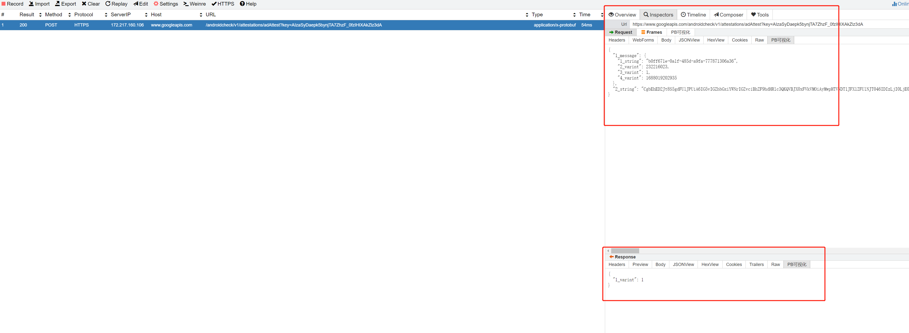

# whistle.pbui

### 解析pb服务 go实现pb解析为json
[pb_json](https://github.com/losemy/pb_json)

### 部署方式
#### 安装对应依赖
npm install axios npm install --save axios
#### npm 安装到whistle
npm link

### 需要注意的点
1. 修改js或者html 需要刷新页面，不然是不会生效
2. http请求需要转化为同步等待再输出，不然会是空的

### 效果图

